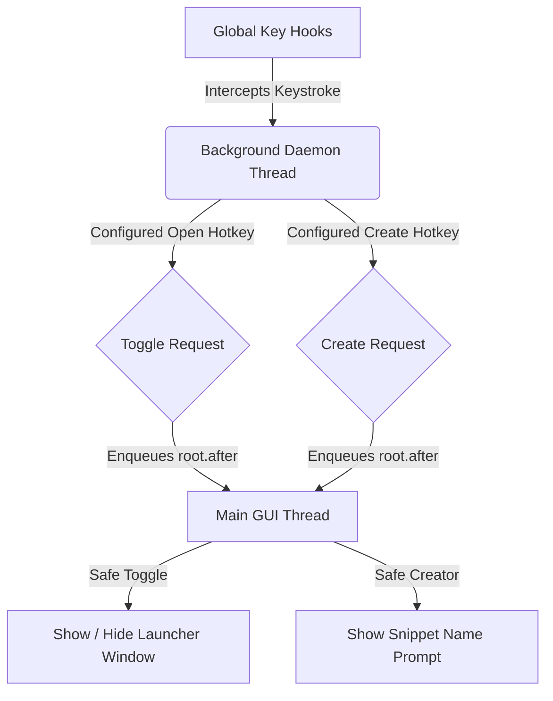

# Antigravity Markdown Snippet Launcher

A keyboard-driven, borderless global search panel (similar to Alfred or macOS Spotlight) for managing, searching, and copying Markdown snippets instantly. Press `Ctrl + Shift + M` to toggle the utility, search reactively, and copy snippets directly to your clipboard. Use `Ctrl + Alt + N` to create snippets on-the-fly from highlighted text. Hotkeys can be changed from the Settings button in the launcher.

---

## 1. Project Overview & Architecture

The application is built in Python using **Tkinter** for the user interface, **keyboard** for global hotkey hooks, and **pyperclip** for system clipboard integration. 

Since Tkinter is not thread-safe, modifying the UI directly from keyboard events (which run in their own background thread) can lead to application crashes. To resolve this, this utility implements a thread-safe message dispatch pattern using `root.after()` to delegate tasks to the Tkinter event loop.

### Process Flow



---

## 2. In-Depth Feature Set

### ⚡ On-the-Fly Snippet Creator (`Ctrl + Alt + N` by default)
* **What it does**: Allows you to save snippets to your library instantly from your browser, editor, or terminal.
* **How to use**: Highlight any text on your screen and press the configured create hotkey. The launcher copies the highlighted selection, prompts you for a name, and writes the snippet to the library when you hit `Enter`.

### 🔍 Reactive Spotlight UI (`Ctrl + Shift + M` by default)
* **Borderless Design**: Frameless spotlight design (`overrideredirect = True`) positioned in the upper-middle third of the screen.
* **Reactive Matching**: Instantly filters files as you type using case-insensitive partial matching.
* **High-Speed Directory Scanning**: Uses `os.scandir` to rapidly search the snippets folder, keeping the UI highly responsive with hundreds of files.
* **Obsidian Dark Theme**: Designed with a sleek Catppuccin Mocha-themed palette (`#181825` base, `#313244` inputs, and `#cba6f7` active lavender highlight).

### ⌨️ Keyboard-First Navigation
* **`Ctrl + Shift + M` by default**: Toggles launcher visibility system-wide.
* **`Ctrl + Alt + N` by default**: Spawns the snippet creator dialog.
* **Settings button**: Opens hotkey settings. Enter values like `ctrl+shift+m`, `alt+space`, or `ctrl+alt+f8`, then save and restart.
* **`Up` / `Down` arrows**: Navigate the filtered listbox directly from the search bar without losing cursor focus.
* **`Enter`**: Reads the selected snippet safely as UTF-8, copies it to the clipboard, hides the launcher, and returns focus to the active window.
* **Optional auto-paste**: Set `AUTO_PASTE = True` in [hotkey_window.py](file:///d:/Projects/Markdown/hotkey_window.py) to automatically send `Ctrl + V` after the launcher hides, pasting the copied snippet into the active window.
* **`Escape`**: Instantly dismisses the panel.

---

## 3. Directory Management

By default, the script watches:
`D:\Markdown Project Foler (DO NOT DELETE)`

On startup:
* The application automatically initializes the directory if it does not exist.
* If the directory is empty, it populates it with standard templates (`welcome.md`, `python_template.md`, `markdown_table.md`, `react_hook.md`) to provide immediate search material.

---

## 4. Requirements & Installation

### Requirements
1. Python 3.6 or later.
2. Windows, macOS, or Linux.

### Installation

1. Clone or download the folder.
2. Install the dependencies listed in [requirements.txt](file:///d:/Projects/Markdown/requirements.txt):
   ```bash
   pip install -r requirements.txt
   ```

### Launching the Application
Execute the main script [hotkey_window.py](file:///d:/Projects/Markdown/hotkey_window.py):
```bash
python hotkey_window.py
```
Or double-click `run_launcher.bat` from this folder. It starts the launcher through `pythonw.exe`, so the app lives in the tray without keeping a console window open.

*(The utility runs in the background. Close the window, use terminal kill commands, or click "Exit App" on the launcher window to close).*

### System Tray
On Windows, the app adds a minimalist tray icon next to the clock. Right-click it to open the launcher, jump directly to Settings, toggle **Run at Startup**, or safely exit the background hotkey listener and UI.

If the launcher does not appear when pressing the configured hotkeys, double-click [start_launcher.bat](file:///d:/Projects/Markdown/start_launcher.bat). It kills any stuck launcher process and starts a fresh visible instance through [start_launcher.ps1](file:///d:/Projects/Markdown/start_launcher.ps1). Recovery attempts are written to `launcher_debug.log`.

### Windows Startup
By default, `run_at_startup` is enabled in `config.json`, so each run creates or refreshes a Windows Startup-folder entry. You can turn it on or off from the tray menu. After the next Windows sign-in, the utility starts automatically and stays available until you close it or shut down the computer.

Startup launches use `--startup`, which keeps the panel hidden in the background until you press the configured open hotkey.

---

## 5. OS-Specific Permissions Guidance

The `keyboard` library interacts directly with input device APIs and raw OS events, requiring specific system-level configurations depending on the OS:

### Linux
* **Issue**: Linux requires root privileges to read input device paths like `/dev/input/`.
* **Fix**: Run the script with `sudo`:
  ```bash
  sudo python hotkey_window.py
  ```

### macOS (Darwin)
* **Issue**: macOS blocks applications from capturing global key events without accessibility rights.
* **Fix**:
  1. Open **System Settings** -> **Privacy & Security** -> **Accessibility**.
  2. Add your Terminal app or editor (e.g. iTerm2, VS Code).
  3. Toggle the permission switch to **ON** and restart the script.

### Windows
* **Issue**: Privilege mismatch (e.g., trying to use the hotkey while focused on an Administrator terminal or elevated game window).
* **Fix**: Run your terminal shell as Administrator before executing the script.

---

## 6. Code Architecture & Classes

The project consists of three main classes inside [hotkey_window.py](file:///d:/Projects/Markdown/hotkey_window.py):

1. **`SnippetWatcher`**: Handles `os.scandir` folder lookups, filters lists case-insensitively, returns absolute paths, and manages directory population.
2. **`SnippetCreateDialog`**: A custom borderless `tk.Toplevel` dialog used for entering snippet names during on-the-fly snippet creation.
3. **`BorderlessSnippetLauncher`**: Main GUI window controller containing layout bindings, fade-in/fade-out transitions, and reactive trace hooks.
